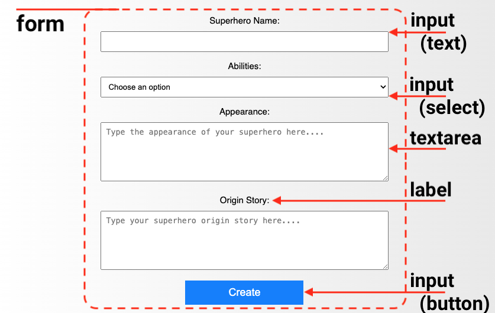

## Add form input fields

In this step, you will design an interactive web page and a web form where the user can create their own superhero!

<iframe src="https://staging-editor.raspberrypi.org/en/embed/viewer/comic-character-step3" width="100%" height="800" frameborder="0" marginwidth="0" marginheight="0" allowfullscreen> </iframe>

You have added text and images to your website. 

There are other types of content, including:
+ Videos
+ Forms
+ Maps
+ Music

HTML **forms** allows the user to input and submit information.

You will add different types of form elements to allow the user to create their superhero character.

**Note:** CSS styling for your form is already provided in the file `styles.css`.

--- collapse ---

---
title: Types of form elements
---

+ `<input>` e.g. single-line text box, checkbox, button.
+ `<textarea>` For entering multiple lines of text.
+ `<label>` Text to tell the user what information to enter.

--- /collapse ---

### Set up the form

All the input elements will be inside a `<section>` with an `id` attribute, so you can update it later.

--- task ---

Open the `character.html` file.

Find the comment `<!--Superhero character details-->`.

Add the attribute `id="character-details"` to the `<section>` tag.

--- code ---
---
language: html
filename: character.html
line_numbers: true
line_number_start: 22
line_highlights: 22
---

      <section id="character-details"> <!--Superhero character details-->
  
      </section>
    
--- /code ---

--- /task ---

### Superhero 'name' section

Users will start by naming their superhero!

--- task ---

Add a `div` element with the attribute `id="name-input"` between the `<section>` tags.

--- code ---
---
language: html
filename: character.html
line_numbers: true
line_number_start: 22
line_highlights: 23-25
---

    <section id="character-details"> <!--Superhero character details-->
      

               
      

    </section>
    
--- /code ---

--- /task ---

--- task ---

Add a `<label>` element to tell the user what they need to enter.

--- code ---
---
language: html
filename: character.html
line_numbers: true
line_number_start: 22
line_highlights: 24
---

    <section id="character-details"> <!--Superhero character details-->
      

        <label>Superhero Name:</label>
               
      

    </section>
    
--- /code ---

--- collapse ---

---
title: Accessible design
---

The `<label>` element allows screen-readers to read the label out loud when a user focuses on the input element.

--- /collapse ---

--- /task ---

An `<input>` element allows the user to enter data.

You set the type of input using `type=`.

--- collapse ---

---
title: Examples of input types
---

+ **text:** Single line of text. 
 `<input type="text">`
 *Try it*:
 <input type="text">

+ **password:** Hides the entered text.
 `<input type="password">`
 *Try it*:
 <input type="password">

+ **checkbox:** Tick one or more options.
 `<input type="checkbox">`
 *Try it*:
 <input type="checkbox">

+ **radio:** Select one or more options. **TODO**
 `<input type="radio">`
 *Try it*:
 <input type="radio">

--- /collapse ---

--- task ---

Add a text `<input>` element with the attribute `id="name-text"`.

--- code ---
---
language: html
filename: character.html
line_numbers: true
line_number_start: 22
line_highlights: 25
---

    <section id="character-details"> <!--Superhero character details-->
      

        <label>Superhero Name:</label>
        <input type="text" id="name-text">     
      

    </section>
    
--- /code ---

**Test:** Click the **Run** button to see your changes.
+ You will see a text box with the label "Superhero Name:" above it.

--- /task ---

**Debug step:**
+ Check you have added `""` marks around `text`.

### Superhero 'ability' section 

Next, the user will choose an ability for their superhero!

+ The `<select>` element is used to create the drop-down list.
+ The `<option>` elements are used to provide choices.

--- collapse ---

---
title: See an example
---

 `<select><option value="Water">Water</option><option value="Juice">Juice</option></select>`
 *Try it*:
 <select><option value="Water">Water</option><option value="Juice">Juice</option></select>

--- /collapse ---

--- task ---

Add a `
` element with the attribute `id="ability-input"`.

Add a `<label>`. 

Add a `<select>` element with **four** `<option>` elements for the choices.

--- code ---
---
language: html
filename: character.html
line_numbers: true
line_number_start: 22
line_highlights: 27-35
---
   
    <section id="character-details"> <!--Superhero character details-->
      

        <label>Superhero Name:</label>
        <input type="text" id="name-text">     
      

      

        <label>Ability:</label>
        <select id="ability-choice">
          <option value="">Choose an option</option>
          <option value="Flying">Flying</option>
          <option value="Invisibility">Invisibility</option>
          <option value="Time travel">Time travel</option>
        </select>
      

    </section>
    
--- /code ---

**Notice:** The first option has a blank `value`.

**Test:** Click the **Run** button to see your changes.
+ You will see a drop-down list.
+ Click the arrow to view the choices.

--- /task ---

**Debug step:**
+ Check you have four `<option>` elements inside your `<select>` elements.
+ Check you have closing `</option>` tags foe each option.

### Superhero 'appearance' section 

Next, the user will describe their superhero's appearance!

The `<textarea>` element provides multi-line text entry.

--- collapse ---

---
title: See an example
---

 `<textarea></textarea>`
 *Try it*:
 <textarea></textarea>

--- /collapse ---

You can add a `placeholder` attribute to an input element.

This gives a hint as to what the user should enter. 

The hint is replaced when the user starts typing.

--- task ---

Create a `
` element with the attribute `id="appearance-input"`.

Add the `<label>` and `<textarea>` HTML inside the `
` element.

Include a `placeholder` attribute for the `<textarea>` element.

--- code ---
---
language: html
filename: character.html
line_numbers: true
line_number_start: 27
line_highlights: 36-39
---

    

      <label>Ability:</label>
      <select id="ability-choice">
        <option value="">Choose an option</option>
        <option value="Flying">Flying</option>
        <option value="Invisibility">Invisibility</option>
        <option value="Time travel">Time travel</option>
      </select>
    

    

      <label>Appearance: </label> 
      <textarea id="appearance-text" placeholder="Describe your superhero!"></textarea>
    

  </section>
    
--- /code ---

**Test:** Click the **Run** button to see your changes.
+ You will see a multi-line text box with the placeholder text.

--- /task ---

### Superhero 'origin story' section 

Next, the user will describe their superhero's origin story!

--- task ---

Create a `
` element with the attribute `id="origin-input"`.

Add the `<label>` and `<textarea>` HTML inside the `
` element.

Include a placeholder attribute for the `<textarea>` element.

--- code ---
---
language: html
filename: character.html
line_numbers: true
line_number_start: 36
line_highlights: 40-43
---

    

      <label>Appearance: </label> 
      <textarea id="appearance-text" placeholder="Type the appearance of your superhero here...."></textarea>
    

    

      <label>Origin Story: </label> 
      <textarea id="origin-text" placeholder="Add your superhero origin story!"></textarea>
    

  </section>
    
--- /code ---

**Test:** Click the **Run** button to see your changes.
+ You will see another multi-line text box showing placeholder text.

--- /task ---

### Superhero 'summary' section 

It would be great to show the user a summary of their character.

--- task ---

Add a new `<section>` element with the attribute `id="summary-section"`.

--- code ---
---
language: html
filename: character.html
line_numbers: true
line_number_start: 44
line_highlights: 45-47
---
      
    </section>
    <section id="summary-section">
  
    </section>
    
--- /code ---

--- /task ---

--- task ---

Add a `<h2>` element to create a title for the summary.

Add a `
` element with the attribute `id="summary-paragraph"`.

--- code ---
---
language: html
filename: character.html
line_numbers: true
line_number_start: 45
line_highlights: 46-47
---

    <section id="summary-section">
      <h2>Superhero Summary</h2>
      

    </section>
    
--- /code ---

**Test:** Click the **Run** button to see your changes.
+ You might expect to see the summary section. However, the `display` property for the `#summary-section` selector has been set to `none`, so it is hidden. Next, you will add a button that can run JavaScript code to show it.

--- collapse ---

---
title: View the summary-section CSS selector
---

--- code ---
---
language: css
filename: style.css
line_numbers: false
line_number_start: 
line_highlights: 6
---

#summary-section {
  background-color: #f8f8f8;
  border: 1px solid #ddd;
  border-radius: 5px;
  padding: 5px;
  display: none;
}
    
--- /code ---

--- /collapse ---

--- /task ---

### Show the summary section

Your user needs to press a button to show the summary section.

An `onclick` event can be added to the button.

JavaScript can be used to react to this event and show the summary.

--- collapse ---

---
title: Examples of events
---

Events can be triggered by the user or the browser.

+ User events:
  + Mouse events (click, double click, mouseover).
  + Keyboard events (keypress, keydown, keyup).
  + Touch events (touchstart, touchmove, touchend).

+ Browser events:
  + Page load events (load, unload).
  + Window events (resize, scroll).
  + Time events (setInterval, setTimeout).

--- /collapse ---

--- task ---

Add a `<button>` element below the origin story `div` with the event `onclick="displaySummary()"`

Add the text 'Create' to the `<button>`, so the user knows what the button does.

--- code ---
---
language: html
filename: character.html
line_numbers: true
line_number_start: 39
line_highlights: 44
---

            

            

                <label>Origin Story: </label> 
                <textarea id="origin-text" placeholder="Type your superhero origin story here...."></textarea>
            

            <button onclick="displaySummary()">Create</button>
        </section>

--- /code ---

**Test:** Click the **Run** button to see your changes.
+ You will see a Create button below your superhero form.
+ The Create button does not do anything at the moment. 
  
In the next step you will create the JavaScript function `displaySummary()` that will handle the `onclick` event.

--- /task ---

Fantastic work! Your character creation page now contains a form with input fields.

In the next step you will make your form interactive, so the user can view a summary of their character. 