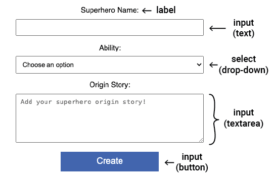

## Add form input fields

In this step, you will design an interactive webpage and a form that the user can use to create their own superhero!

<iframe src="https://editor.raspberrypi.org/en/embed/viewer/comic-character-step3?page=character.html" width="100%" height="800" frameborder="0" marginwidth="0" marginheight="0" allowfullscreen> </iframe>

You have added text and images to your website, but your user can change the content too!

HTML **forms** allow the user to input and submit information.

You will add different types of form elements to allow the user to create their superhero character.

**Note:** CSS styling for your form is already provided in the file `style.css`.

--- collapse ---

---
title: Types of form elements
---

+ `<input>` e.g. single-line text box, checkbox, button
+ `<select>` A drop-down list
+ `<textarea>` For entering multiple lines of text
+ `<label>` Text to tell the user what information to enter

--- /collapse ---

### Set up the form

All the input elements will be inside a `<section>` with an `id` attribute, so you can update it later.

--- task ---

Open the `character.html` file.

Find the comment `<!--Superhero character details-->`.

Add the attribute `id="character-details"` to the `<section>` tag.

--- code ---
---
language: html
filename: character.html
line_numbers: true
line_number_start: 23
line_highlights: 23
---

      <section id="character-details"> <!--Superhero character details-->
  
      </section>
    
--- /code ---

--- /task ---

### Superhero 'name' section

The user will start by naming their superhero!

A `<label>` tells the user what they need to enter.

--- task ---

Add a `<label>` element with the attribute `"for=name-text"`

--- code ---
---
language: html
filename: character.html
line_numbers: true
line_number_start: 23
line_highlights: 24
---

    <section id="character-details"> <!--Superhero character details-->
      <label for="name-text">Superhero Name:</label>
    </section>
    
--- /code ---

--- collapse ---

---
title: Accessible design
---

The `<label>` element allows screen-readers to read the label out loud when a user focuses on the input element.
Adding a `for` attribute links the label to an input element.

--- /collapse ---

--- /task ---

An `<input>` element allows the user to enter data.

You set the type of input using `type=`.

--- collapse ---

---
title: Examples of input types
---

+ **Text:** Single line of text. 
 `<input type="text">`
 *Try it*:
 <input type="text">

+ **Password:** Hides the entered text.
 `<input type="password">`
 *Try it*:
 <input type="password">

+ **Checkbox:** Tick one or more options.
 `<input type="checkbox"> <label>Breakfast</label>`
 `<input type="checkbox"> <label>Lunch</label>`
 *Try it*:
 <input type="checkbox"><label>Breakfast</label>
 <input type="checkbox"><label>Lunch</label>

+ **Radio:** Select one option from a group.
 `<input type="radio" name="meal"> <label>Breakfast</label> `
 `<input type="radio" name="meal"> <label>Lunch</label>`
 *Try it*:
 <input type="radio" name="meal"><label>Breakfast</label>
 <input type="radio" name="meal"><label>Lunch</label>
 **Tip:** The radio buttons must have the same `name` attribute so that selecting a radio button deselects any other selected radio button. 

+ **Number:** Numeric data with arrows to increase/decrease the value 
 `<input type="number">`
 *Try it*:
 <input type="number">

--- /collapse ---

--- task ---

Add a text `<input>` element with the attribute `id="name-text"`.

--- code ---
---
language: html
filename: character.html
line_numbers: true
line_number_start: 23
line_highlights: 25
---

    <section id="character-details"> <!--Superhero character details-->
      <label for="name-text">Superhero Name:</label>
      <input type="text" id="name-text">
    </section>
    
--- /code ---

--- /task ---

--- task ---

**Click Run**
+ You will see a text box with the label "Superhero Name:" above it.

--- collapse ---

---
title: There is no text box
---
+ Check you have added `""` marks around `text`.

--- /collapse ---

--- collapse ---

---
title: The text box is very small
---
+ Check you have given the `<input>` the id `"name-text"`, not `"name"`.

--- /collapse ---

--- /task ---

### Superhero 'ability' section 

Next, the user will choose an ability for their superhero!

+ The `<select>` element is used to create the drop-down list
+ The `<option>` elements are used to provide choices

--- collapse ---

---
title: See an example
---

 `<select><option value="Water">Water</option><option value="Juice">Juice</option></select>`
 *Try it*:
 <select><option value="Water">Water</option><option value="Juice">Juice</option></select>

--- /collapse ---

--- task ---

Add a `<label>` element with the attribute `for="ability-choice"`.

Add a `<select>` element with the attribute `id="ability-choice"` and **four** `<option>` elements for the choices.

--- code ---
---
language: html
filename: character.html
line_numbers: true
line_number_start: 23
line_highlights: 26-32
---
   
    <section id="character-details"> <!--Superhero character details-->
      <label for="name-text">Superhero Name:</label>
      <input type="text" id="name-text">     
      <label for="ability-choice">Ability:</label>
      <select id="ability-choice">
        <option value="">Choose an option</option>
        <option value="Flying">Flying</option>
        <option value="Invisibility">Invisibility</option>
        <option value="Time travel">Time travel</option>
      </select>
    </section>
    
--- /code ---

**Notice:** The first option has a blank `value`.

--- /task ---

--- task ---

**Click Run**
+ You will see a drop-down list
+ Click the arrow to view the choices

--- collapse ---

---
title: There are no options in my drop-down list
---
+ Check you have four `<option>` elements inside your `<select>` elements
+ Check you have closing `</option>` tags for each option

--- /collapse ---

--- /task ---

### Superhero 'origin story' section 

Next, the user will describe their superhero's origin story!

The `<textarea>` element provides multi-line text entry.

--- collapse ---

---
title: See an example
---

 `<textarea></textarea>`
 *Try it*:
 <textarea></textarea>

--- /collapse ---

You can add a `placeholder` attribute to an input element.

This gives a hint as to what the user should enter. 

The hint is replaced when the user starts typing.

--- task ---

Add the `<label>` and `<textarea>` HTML.

Include a placeholder attribute for the `<textarea>` element.

--- code ---
---
language: html
filename: character.html
line_numbers: true
line_number_start: 26
line_highlights: 33-45
---

    <label for="ability-choice">Ability:</label>
    <select id="ability-choice">
      <option value="">Choose an option</option>
      <option value="Flying">Flying</option>
      <option value="Invisibility">Invisibility</option>
      <option value="Time travel">Time travel</option>
    </select>
    <label for="origin-text">Origin Story:</label>
    <textarea id="origin-text" placeholder="Add your superhero origin story!"></textarea>
  </section>
    
--- /code ---

--- /task ---

--- task ---

**Click Run**
+ You will see a multi-line text box showing placeholder text.

--- /task ---

### Superhero 'summary' section 

It would be great to show the user a summary of their character.

--- task ---

Add a new `<section>` element with the attribute `id="summary-section"`.

--- code ---
---
language: html
filename: character.html
line_numbers: true
line_number_start: 35
line_highlights: 36-39
---
      
    </section>
    <section id="summary-section">
  
    </section>
    
--- /code ---

--- /task ---

--- task ---

Add a `<h2>` element to create a title for the summary.

Add a `
` element with the attribute `id="summary-paragraph"`.

--- code ---
---
language: html
filename: character.html
line_numbers: true
line_number_start: 36
line_highlights: 37-38
---

    <section id="summary-section">
      <h2>Superhero Summary</h2>
      

    </section>
    
--- /code ---

--- /task ---

--- task ---

**Click Run**
+ You might expect to see the summary section. However, the `display` property for the `#summary-section` selector is set to `none`, so it is hidden. 

--- collapse ---

---
title: View the summary-section CSS selector
---

--- code ---
---
language: css
filename: style.css
line_numbers: false
line_number_start: 
line_highlights: 6
---

#summary-section {
  background-color: var(--background-colour-section);
  border: 1px solid var(--border-colour-section);
  border-radius: 5px;
  padding: 5px;
  display: none;
}
    
--- /code ---

--- /collapse ---

Next, you will add a button that will run some JavaScript code to make the summary visible. 

--- /task ---

Fantastic work! Your character details page now contains a form with input fields.

In the next step, you will make your form interactive, so the user can view a summary of their character. 
