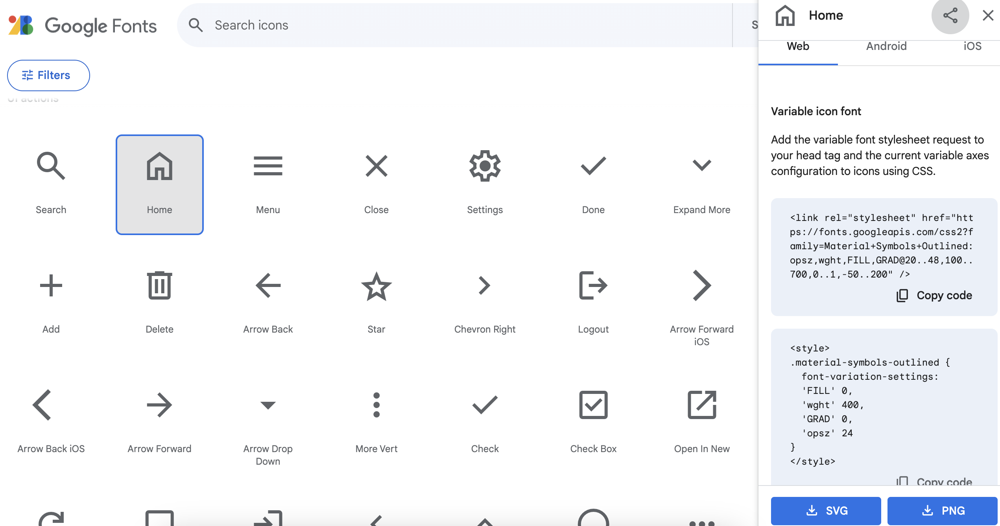

## Create light mode theme

In this step, you will create a switch so the user can change between dark mode and light mode. 

The website will remember the user's choice even if they navigate to another page.

<iframe src="https://staging-editor.raspberrypi.org/en/embed/viewer/comic-character-step7" width="100%" height="800" frameborder="0" marginwidth="0" marginheight="0" allowfullscreen> </iframe>

**Light and dark** colour themes are used when designing websites and apps. Dark mode is a colour scheme that uses light-coloured text and icons on dark backgrounds. Light mode is the opposite of this. Providing this option to the user improves readability and accessibility.

Your `style.css` file includes selectors used to update your website's colour scheme.

--- collapse ---

**Tip:** This is just here to remind you. You don't have to write it again!

---
title: Light mode styles
---

--- code ---
---
language: css
filename: style.html
line_numbers: true
line_number_start: 244
---

/* Light Mode Styles */

body.light-mode {
  background: var(--background-colour-light-mode);
  color: var(--text-colour-light-mode);
}

.light-mode .navigation {
  background-color: var(--background-colour-light-mode-navigation);
}

.light-mode .year {
  color: var(--text-colour-light-mode-year);
}

.light-mode .logo {
  color: var(--text-colour-light-mode-logo);
}

.light-mode nav a {
  color: var(--text-colour-light-mode-nav);
}

.light-mode nav a:hover {
  color: var(--text-colour-light-mode-nav-hover);
}

.light-mode .header {
  background: var(--background-colour-light-mode-header);
}

.light-mode footer {
  background: var(--background-colour-light-mode-footer);
  color: var(--text-colour-light-mode-footer);
}

--- /code ---

--- /collapse ---

### Add a switch to the header

You have already used `<button>` elements to trigger an event. 

You need to use a checkbox (<input type="checkbox">) styled as a switch, so the user can change between colour themes.

--- task ---

Open `index.html`.

Create a `
` element below the `<nav>` element in the `<header>` section.

Give it the attribute `class="switch-container"`

--- code ---
---
language: html
filename: index.html
line_numbers: true
line_number_start: 19
line_highlights: 20-22
---

      </nav>
      

      

    </header>  
      
--- /code ---

--- /task ---

The switch uses three elements, `<label>`, `<input>`, and ``

You have used some of these when you created the character details form. 

--- task ---

Inside the `
` tags, add a `<label>` with the attribute `class="switch"`

Inside the `<label>` tags, add:
+ an `<input>` element with two attributes: `type="checkbox"` and `id="lightModeSwitch"`
+ a `` element with the attribute `class="switch"`

--- code ---
---
language: html
filename: index.html
line_numbers: true
line_number_start: 20
line_highlights: 21-24
---

    

      <label class="switch">
        <input type="checkbox" id="lightModeSwitch">
        
      </label>
      
    

      
--- /code ---

--- /task ---

--- task ---

**Click Run**
+ **Notice:** The `.switch` selector provides styling to convert the checkbox into a switch shape.

--- /task ---

### Add an icon to the switch

You can show the user an icon that represents light mode rather than show them the phrase "light mode"

Google fonts provides icons and a way to add them to your website. 

**Icons** are an accessible way of representing text because they are universally understood.

The Google icon has already been included inside the `<head>` element of your webpages. The CSS styles have also been provided.

--- collapse ---

---
title: How to import icons using Google fonts
---

Open [fonts.google.com](https://fonts.google.com/icons){:target="_blank"}. The link will open in a new tab.

You can search for icons. Each icon has a unique name.

Click on the icon you want to add. This will open some instructions

+ Include Icons in HTML:
Add this in the `<head>` section of an HTML file.

    <link rel="stylesheet" href="https://fonts.googleapis.com/icon?family=Material+Icons">

+ Use Icons in HTML:
Add a class to an HTML element. For example:

    home

+ CSS Styling:
Add the icon’s custom styles to your CSS stylesheet. You can also customise it:
    
    .material-symbols-outlined {
      font-variation-settings:
      'FILL' 0,
      'wght' 400,
      'GRAD' 0,
      'opsz' 24
    }

--- /collapse ---

--- task ---

Below the `</label>` tag, add a `` element with the attribute `class="switch-label material-symbols-outlined"`.

Add the text: 'light_mode' inside the `` element.

--- code ---
---
language: html
filename: index.html
line_numbers: true
line_number_start: 20
line_highlights: 25
---

    

      <label class="switch">
        <input type="checkbox" id="lightModeSwitch">
        
      </label>
      light_mode
    

      
--- /code ---

--- /task ---

--- task ---

**Click Run**
+ Your switch should appear on the right in your nav bar.
+ You can click the switch, but it will not do anything... yet!

--- collapse ---

---
title: The switch does not display properly
---

+ Check you have left spaces between your attributes where you have multiple attributes in an element.

--- /collapse ---

--- /task ---

### Create an event handler for your switch

--- task ---

Open `scripts.js`. 

Find the comment `// Create the constant for light mode`

Use `querySelector()` to find the element with the attribute `id="lightModeSwitch"`.

Assign it to a constant `lightModeSwitch`. 

--- code ---
---
language: js
filename: scripts.js
line_numbers: true
line_number_start: 55
line_highlights: 56
---
// Create the constant for light mode
const lightModeSwitch = document.querySelector("#lightModeSwitch");

--- /code ---

--- /task ---

--- task ---

Find the comment `// Light mode function`

Create the function `changeLightMode()`.

--- code ---
---
language: js
filename: scripts.js
line_numbers: true
line_number_start: 58
line_highlights: 59-61
---
   
// Light mode function
function changeLightMode(){
  
}

--- /code ---

--- /task ---

You added an `<input>` element with the attribute `type="checkbox"` and styled it as a switch.

You can check if a switch is 'on' using the `.checked` property.

The value of the `.checked` property is Boolean, meaning it can either be **true** (on) or **false** (off).

--- task ---

Make the function assign the value of the switch's `.checked` property to the variable `isLightMode`.

--- code ---
---
language: js
filename: scripts.js
line_numbers: true
line_number_start: 58
line_highlights: 60
---
   
// Light mode function 
function changeLightMode(){
  var isLightMode = lightModeSwitch.checked;

}

--- /code ---

--- /task ---

The `.classList` property returns an element's `class` attributes.

You can modify an element's class attributes using methods. 

For example, you can add(), toggle() or remove() an element's classes.

--- collapse ---

---
title: classList methods
---

+ Accessing classList:
`element.classList` returns a list of the specified element's class attributes.

+ Adding a Class: `element.classList.add("className")`

+ Removing a Class: `element.classList.remove("className")`

+ Toggling a Class: `element.classList.toggle("className")` (If the class is present, it is removed; otherwise, it is added.)

+ Checking if a Class Exists: `element.classList.contains("className")` returns a Boolean value confirming whether the element contains the specified class.

+ Replacing Classes: `element.classList.replace("oldClass", "newClass")` replaces the specified old class with a new one.

--- /collapse ---

--- task ---

Use the `.toggle` method to add or remove the `light-mode` class to the `<body>` element.

This will add the class to the element if it is not there, or remove it if it is.

--- code ---
---
language: js
filename: scripts.js
line_numbers: true
line_number_start: 58
line_highlights: 61
---

// Light mode function 
function changeLightMode(){
  var isLightMode = lightModeSwitch.checked;
  document.body.classList.toggle("light-mode");

}

--- /code ---

--- /task ---

### Add the event handler to the switch

--- task ---

Open `index.html`.

Add the event `onchange="changeLightMode()"` to the switch element.

--- code ---
---
language: html
filename: index.html
line_numbers: true
line_number_start: 20
line_highlights: 22
---

      

        <label class="switch">
          <input onchange="changeLightMode()" type="checkbox" id="lightModeSwitch">
          
        </label>
        light_mode
      

      
--- /code ---

--- /task ---

--- task ---

**Click Run** 
+ Click on the switch to slide it into the light mode position.
+ The colours of your webpage should change.

--- /task ---

### Save the user's preference

The switch adds or removes the light-mode class. 

When your user navigates to another page (or reloads the current one) the changes will be lost as the `light-mode` class attribute is not set in the HTML file. 

You need a way to keep the user's choice.

You can do this with the `localStorage` property.

`localStorage` holds data as key-value pairs. A ***key*** is a 'label' for a value.

--- collapse ---

---
title: localStorage methods
---

+ setItem(key, value):
Adds a key-value pair to localStorage.
Example: `localStorage.setItem("username", "raspberry")`

+ getItem(key):
Retrieves the value associated with the specified key.
Example: `var username = localStorage.getItem("username")`

+ removeItem(key):
Removes the key-value pair associated with the specified key.
Example: `localStorage.removeItem("username")`

+ clear():
Removes all key-value pairs from localStorage.
Example: `localStorage.clear()`

--- /collapse ---

--- task ---

Open `scripts.js`.

Use the `.setItem` method to add the key-value pair:
+ Set the 'key' to `"lightMode"`
+ Set the 'value' to `isLightMode`: representing the Boolean (true or false) value of the toggle's `.checked` property.

--- code ---
---
language: js
filename: scripts.js
line_numbers: true
line_number_start: 58
line_highlights: 62
---
   
// Light mode function 
function changeLightMode(){
  var isLightMode = lightModeSwitch.checked;
  document.body.classList.toggle("light-mode");
  localStorage.setItem("lightMode", isLightMode);
}

--- /code ---

--- /task ---

### Get the user's preference

When the webpage loads, you need to check if lightMode was set.

You can use `addEventListener` for this.

--- collapse ---

---
title: The addEventListener method
---

Use `.addEventListener` like this:

--- code ---
---
language: js
filename: 
line_numbers: false
line_number_start: 
line_highlights: 
---
   
element.addEventListener(eventType, callbackFunction);

--- /code ---

+ element: The HTML element to which you want to attach the event listener.
+ eventType: The type of event you want to listen for (e.g. "click", "keydown", "DOMContentLoaded").
+ callbackFunction: The function to be executed when the event happens.

--- /collapse ---

--- task ---

Use `.addEventListener` to trigger a function in response to a page load event.

--- code ---
---
language: js
filename: scripts.js
line_numbers: true
line_number_start: 65
line_highlights: 66-68
---

// Check local storage
document.addEventListener("DOMContentLoaded", function () {

}); 
      
--- /code ---

`"DOMContentLoaded"` is an `eventType` that is triggered when the webpage is ready. 

**Tip:** It is better to use `"DOMContentLoaded"` here rather than the `"load"` eventType, which is only triggered when all images are loaded.

--- /task ---

You need the function to check `localStorage` to see if the 'value' paired with the `lightMode` 'key' is **"true"**.

--- task ---

Add an `if` statement to check if `lightMode` is set to `"true"`

--- code ---
---
language: js
filename: scripts.js
line_numbers: true
line_number_start: 65
line_highlights: 68-70
---

// Check local storage
document.addEventListener("DOMContentLoaded", function () {

  if (localStorage.getItem("lightMode") == "true") {

  }

}); 
  
--- /code ---

--- /task ---

If `lightMode` is set to `"true"`, you need to add the `.light-mode` class.

You can use the `.toggle` method from the `classList` property to achieve this.

**Tip:** You could also use the `.add` method.

--- task ---

Toggle the `light-mode` class.

--- code ---
---
language: js
filename: scripts.js
line_numbers: true
line_number_start: 65
line_highlights: 69
---

// Check local storage
document.addEventListener("DOMContentLoaded", function () {    
  
  if (localStorage.getItem("lightMode") == "true") {
    document.body.classList.toggle("light-mode");
  }

});
  
--- /code ---

--- /task ---

You also have to show the switch as 'on'.

If this isn't done, the light mode preference would be set, but the switch position would be set to 'off'.

--- task ---

Set the value of the switch's `.checked` property to the Boolean value `true`.

--- code ---
---
language: js
filename: scripts.js
line_numbers: true
line_number_start: 65
line_highlights: 70
---

// Light mode function 
document.addEventListener("DOMContentLoaded", function () {    
  
  if (localStorage.getItem("lightMode") == "true") {
    document.body.classList.toggle("light-mode");
    lightModeSwitch.checked = true;
  }

});
  
--- /code ---

--- /task ---

--- task ---

Open `character.html`.

Add the HTML for the switch to the header below the `</nav>` tag.

--- code ---
---
language: html
filename: character.html
line_numbers: true
line_number_start: 19
line_highlights: 20-26
---

      </nav>
      

        <label class="switch">
          <input onchange="changeLightMode()" type="checkbox" id="lightModeSwitch">
          
        </label>
        light_mode
      

    </header>  
      
--- /code ---

--- /task ---

--- task ---

**Click Run** 
+ Your switch should appear in your nav bar to the right.
+ Click the switch on and off to see the theme colours change.
+ Navigate to the `index.html` page to check that your light mode preference stays on.

--- /task ---

Great work! You have created a switch that allows the user to change colour themes. 

Next, you will add a hero slider to your website and allow the user to see different images!