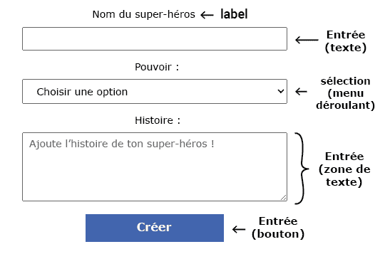

## Ajouter des champs de saisie de formulaire

Dans cette étape, tu vas créer une page web interactive et un formulaire que l'utilisateur peut utiliser pour créer son propre super-héros !

<iframe src="https://editor.raspberrypi.org/en/embed/viewer/comic-character-step3?page=character.html" width="100%" height="800" frameborder="0" marginwidth="0" marginheight="0" allowfullscreen> </iframe>

Tu as ajouté du texte et des images à ton site web, mais ton utilisateur peut également en modifier le contenu !

<p style="border-left: solid; border-width:10px; border-color: #0faeb0; background-color: aliceblue; padding: 10px;">
Les <span style="color: #0faeb0">**formulaires**</span> HTML permettent à l'utilisateur de saisir et de soumettre des informations.
</p>

Tu ajouteras différents types d'éléments de formulaire pour permettre à l'utilisateur de créer son personnage de super-héros.

**Remarque :** le style CSS pour ton formulaire est déjà fourni dans le fichier `style.css`.

\--- collapse ---

---

## title: Types d'éléments de formulaire



- `<input>` Par exemple la case de texte à une ligne, la case à cocher, le bouton
- `<select>` Une liste déroulante
- `<textarea>` Pour entrer plusieurs lignes de texte
- `<label>` Texte pour indiquer à l'utilisateur quelles informations entrer

\--- /collapse ---

### Configurer le formulaire

Tous les éléments d'entrée seront à l'intérieur d'une `<section>` avec un attribut `id`, tu pourras le mettre à jour plus tard.

\--- task ---

Ouvre le fichier `character.html`.

Trouve le commentaire `<!--Informations sur le personnage de super-héros-->`.

Ajoute l'attribut `id="character-details"` à la balise `<section>`.

## --- code ---

language: html
filename: character.html
line_numbers: true
line_number_start: 23
line_highlights: 23
--------------------------------------------------------

```
  <section id="character-details"> <!--Informations sur le personnage de super-héros-->

  </section>
```

\--- /code ---

\--- /task ---

### Section « nom » du super-héros

L'utilisateur commencera par nommer son super-héros !

Un `<label>` indique à l'utilisateur ce qu'il doit entrer.

\--- task ---

Ajoute un élément `<label>` avec l'attribut `"for=name-text"`

## --- code ---

language: html
filename: character.html
line_numbers: true
line_number_start: 23
line_highlights: 24
--------------------------------------------------------

```
<section id="character-details"> <!--Informations sur le personnage de super-héros-->
  <label for="name-text">Nom du super-héros :</label>
</section>
```

\--- /code ---

\--- collapse ---

---

## title: Conception accessible

L'élément `<label>` permet aux lecteurs d'écran de lire le label à haute voix lorsqu'un utilisateur se concentre sur l'élément d'entrée.
L'ajout d'un attribut `for` relie le label à un élément d'entrée.

\--- /collapse ---

\--- /task ---

Un élément `<input>` permet à l'utilisateur d'entrer des données.

Tu définis le type d'entrée en utilisant `type=`.

\--- collapse ---

---

## title: Exemples de types d'entrée

- **Texte :** une seule ligne de texte. <br>`<input type="text">` <br>_Essaie-le_ : <br><input type="text">

- **Mot de passe :** masque le texte entré. <br>`<input type="password">` <br>_Essaie-le_ : <br><input type="password">

- **Case à cocher :** coche une ou plusieurs options. <br>`<input type="checkbox"> <label>Petit déjeuner</label>` <br>`<input type="checkbox"> <label>Déjeuner</label>` <br>_Essaie-le_ : <br><input type="checkbox"><label>Petit déjeuner</label> <br><input type="checkbox"><label>Déjeuner</label>

- **Radio :** sélectionne une option dans un groupe. <br>`<input type="radio" name="meal"> <label>Petit déjeuner</label> ` <br>`<input type="radio" name="meal"> <label>Déjeuner</label>` <br>_Essaie-le_ : <br><input type="radio" name="meal"><label>Petit déjeuner</label> <br><input type="radio" name="meal"><label>Déjeuner</label> <br>**Astuce :** les boutons radio doivent avoir le même attribut `name` afin que la sélection d'un bouton radio désélectionne tout autre bouton radio sélectionné.

- **Nombre :** données numériques avec des flèches pour augmenter/diminuer la valeur <br>`<input type="number">` <br>_Essaie-le_ : <br><input type="number">

\--- /collapse ---

\--- task ---

Ajoute un élément texte `<input>` avec l'attribut `id="name-text"`.

## --- code ---

language: html
filename: character.html
line_numbers: true
line_number_start: 23
line_highlights: 25
--------------------------------------------------------

```
<section id="character-details"> <!--Informations sur le personnage de super-héros-->
  <label for="name-text">Nom du super-héros :</label>
<input type="text" id="name-text">
</section>
```

\--- /code ---

\--- /task ---

\--- task ---

**Clique sur Run**

- Tu verras une zone de texte avec le label « Nom du super-héros : » au-dessus de celui-ci.

\--- collapse ---

---

## title: Il n'y a pas de zone de texte

- Vérifie que tu as ajouté des marques `""` autour de `text`.

\--- /collapse ---

\--- collapse ---

---

## title: La zone de texte est très petite

- Vérifie que tu as donné au `<input>` l'id `"name-text"`, et pas `"name"`.

\--- /collapse ---

\--- /task ---

### Section « Pouvoir » du super-héros

Ensuite, l'utilisateur choisira un pouvoir pour son super-héros !

- L'élément `<select>` est utilisé pour créer la liste déroulante
- Les éléments `<option>` sont utilisés pour fournir des choix

\--- collapse ---

---

## title: Voir un exemple

<br>`<select><option value="Water">Eau</option><option value="Juice">Jus</option></select>` <br>_Essaie-le_ : <br><select><option value="Water">Eau</option><option value="Juice">Jus</option></select>

\--- /collapse ---

\--- task ---

Ajoute un élément `<label>` avec l'attribut `for="ability-choice"`.

Ajoute un élément `<select>` avec l'attribut `id="ability-choice"` et **quatre** `<option>` pour les choix.

## --- code ---

language: html
filename: character.html
line_numbers: true
line_number_start: 23
line_highlights: 26-32
-----------------------------------------------------------

```
<section id="character-details"> <!--Informations sur le personnage de super-héros-->
  <label for="name-text">Nom du super-héros :</label>
  <input type="text" id="name-text">     
  <label for="ability-choice">Pouvoir :</label>
  <select id="ability-choice">
    <option value="">Choisir une option</option>
    <option value="Flying">Vol</option>
    <option value="Invisibility">Invisibilité</option>
    <option value="Time travel">Voyage dans le temps</option>
  </select>
</section>
```

\--- /code ---

**Remarque :** la première option a une `valeur` vide.

\--- /task ---

\--- task ---

**Clique sur Run**

- Tu verras une liste déroulante
- Clique sur la flèche pour voir les choix

\--- collapse ---

---

## title: Il n'y a pas d'options dans ma liste déroulante

- Vérifie que tu as quatre éléments `<option>` à l'intérieur de tes éléments `<select>`
- Vérifie que tu as des balises de fermeture `</option>` pour chaque option

\--- /collapse ---

\--- /task ---

### Section « Histoire » du super-héros

Ensuite, l'utilisateur décrira l'histoire de son super-héros !

L'élément `<textarea>` fournit une saisie de texte sur plusieurs lignes.

\--- collapse ---

---

## title: Voir un exemple

<br>`<textarea></textarea>` <br>_Essaie-le_ : <br><textarea></textarea>

\--- /collapse ---

Tu peux ajouter un attribut `placeholder` à un élément d'entrée.

Cela donne un indice sur ce que l'utilisateur doit entrer.

L'indice est remplacé lorsque l'utilisateur commence à taper.

\--- task ---

Ajoute l'HTML `<label>` et `<textarea>`.

Inclus un attribut placeholder pour l'élément `<textarea>`.

## --- code ---

language: html
filename: character.html
line_numbers: true
line_number_start: 26
line_highlights: 33-45
-----------------------------------------------------------

```
<label for="ability-choice">Pouvoir :</label>
<select id="ability-choice">
  <option value="">Choisir une option</option>
  <option value="Flying">Vol</option>
  <option value="Invisibility">Invisibilité</option>
  <option value="Time travel">Voyage dans le temps</option>
</select>
<label for="origin-text">Histoire :</label>
<textarea id="origin-text" placeholder="Add your superhero origin story!"></textarea>
```

  </section>

\--- /code ---

\--- /task ---

\--- task ---

**Clique sur Run**

- Tu verras apparaître une zone de texte de plusieurs lignes contenant un placeholder (texte de remplacement).

\--- /task ---

### Section « Résumé » du super-héros

Ce serait bien de montrer à l'utilisateur un résumé de son personnage.

\--- task ---

Ajoute un nouvel élément `<section>` avec l'attribut `id="summary-section"`.

## --- code ---

language: html
filename: character.html
line_numbers: true
line_number_start: 35
line_highlights: 36-39
-----------------------------------------------------------

```
</section>
<section id="summary-section">

</section>
```

\--- /code ---

\--- /task ---

\--- task ---

Ajoute un élément `<h2>` pour créer un titre pour le résumé.

Ajoute un élément `<p>` avec l'attribut `id="summary-paragraph"`.

## --- code ---

language: html
filename: character.html
line_numbers: true
line_number_start: 36
line_highlights: 37-38
-----------------------------------------------------------

```
<section id="summary-section">
  <h2>Résumé du super-héros</h2>
  <p id="summary-paragraph"></p>
</section>
```

\--- /code ---

\--- /task ---

\--- task ---

**Clique sur Run**

- Tu peux t'attendre à voir la section résumé. Cependant, la propriété `display` du sélecteur `#summary-section` est définie à `none`, donc elle est cachée.

\--- collapse ---

---

## title: Voir le sélecteur CSS de la section résumé

## --- code ---

language: css
filename: style.css
line_numbers: false
line_number_start:
line_highlights: 6
-------------------------------------------------------

\#summary-section {
background-color: var(--background-colour-section);
border: 1px solid var(--border-colour-section);
border-radius: 5px;
padding: 5px;
display: none;
}

\--- /code ---

\--- /collapse ---

Ensuite, tu vas ajouter un bouton qui exécutera du code JavaScript pour rendre le résumé visible.

\--- /task ---

Super boulot ! La page d'informations de ton personnage contient maintenant un formulaire avec les champs de saisie.

Dans la prochaine étape, tu rendras ton formulaire interactif, de sorte que l'utilisateur peut voir un résumé de leur personnage.
