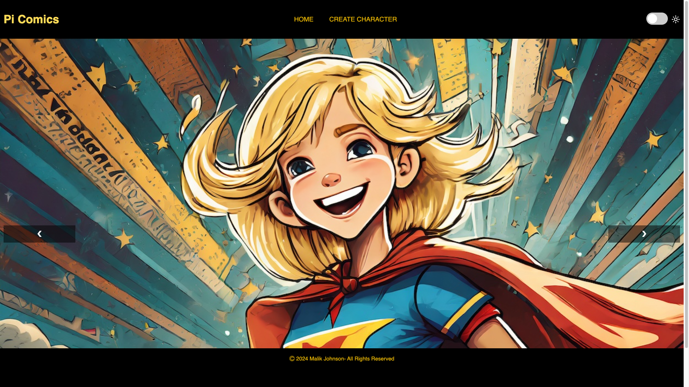

## Inleiding

In dit project combineer je JavaScript, HTML en CSS om een interactieve website te maken waarop de gebruiker zijn eigen superheldenpersonage kan ontwerpen!

**JavaScript** is de programmeertaal van het web en wordt gebruikt om websites dynamisch en interactief te maken. Het is een zeer populaire programmeertaal en zonder die taal zouden websites statisch en saai zijn.

Je gaat:

- JavaScript gebruiken om tekst op een webpagina te wijzigen
- Een formulier toevoegen en invoer opties om mensen een superheld personage te laten maken
- JavaScript gebruiken om elementen op je website te tonen en te verbergen
- De opties voor light en dark mode toevoegen aan je website
- Gebruikersvoorkeuren behouden
- Een image slider maken die door afbeeldingen scrolt

--- no-print ---

--- task ---

### Probeer het uit

  
Ontdek de superheldenwebsite. 

- Klik op de pijlen op de schuifbalk van de homepage om door de afbeeldingen te bewegen
- Klik op de light mode schakelaar om de thema-kleuren te wijzigen
- Ga naar de pagina Personage maken en vul de invoervelden in om je eigen superheldenpersonage te creëren!

<iframe src="https://editor.raspberrypi.org/nl-NL/embed/viewer/comic-character-complete" width="100%" height="800" frameborder="0" marginwidth="0" marginheight="0" allowfullscreen> </iframe>

--- collapse ---

---
title: Afbeeldingen in dit project
---

Afbeeldingen die zijn opgenomen in dit project zijn gemaakt met behulp van generatieve AI. Model: Firefly Image 2

--- /collapse ---

--- /task ---

--- /no-print ---

--- print-only ---

--- /print-only ---
