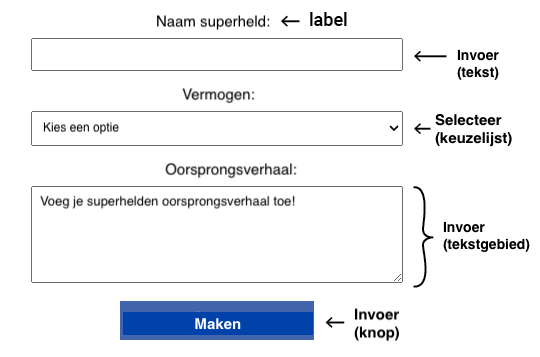

## Formulier invoervelden toevoegen

In deze stap ontwerp je een interactieve webpagina en een formulier waarmee de gebruiker zijn eigen superheld kan maken!

<iframe src="https://editor.raspberrypi.org/nl-NL/embed/viewer/comic-character-step3?page=character.html" width="100%" height="800" frameborder="0" marginwidth="0" marginheight="0" allowfullscreen> </iframe>

Je hebt tekst en afbeeldingen toegevoegd aan je website, maar je gebruiker kan ook de inhoud wijzigen!

HTML **formulieren** stellen de gebruiker in staat om informatie in te voeren en te verzenden.

Je gaat verschillende types formulierelementen toevoegen zodat de gebruiker zijn eigen superheldenpersonage kan maken.

**Opmerking:** CSS styling voor je formulier is al beschikbaar in het bestand `style.css`.

--- collapse ---

---
title: Typen formulierelementen
---

- `<input>` bijv. een enkelregelig tekstvak, selectievakje, knop
- `<select>` Een keuzelijst
- `<textarea>` Voor het invoeren van meerdere tekstregels
- `<label>` Tekst om de gebruiker te vertellen welke informatie hij moet invoeren

--- /collapse ---

### Formulier instellen

Alle invoerelementen bevinden zich in een `<section>` met een `id`-attribuut, zodat je dit later kunt bijwerken.

--- task ---

Open het `character.html` bestand.

Vind de opmerking `<!-- Superheld personage details -->`.

Voeg het attribuut `id="character-details"` toe aan de `<section>` tag.

--- code ---
---
language: html
filename: character.html
line_numbers: true
line_number_start: 23
line_highlights: 23
---

      <section id="character-details"> <!-- Superheld personage details -->

      </section>

--- /code ---

--- /task ---

### Superheld 'naam' sectie

De gebruiker begint met het bedenken van een naam voor zijn superheld!

Een `<label>` vertelt de gebruiker wat hij moet invoeren.

--- task ---

Voeg een `<label>`-element toe met het kenmerk `"for=name-text"`

--- code ---
---
language: html
filename: character.html
line_numbers: true
line_number_start: 23
line_highlights: 24
---

    <section id="character-details"> <!-- Superhero personage details -->
      <label for="name-text">Naam van je superheld:</label>
    </section>

--- /code ---

--- collapse ---

---
title: Toegankelijk ontwerp
---

Het `<label>` element staat screen-readers toe om het label voor te lezen wanneer een gebruiker op het invoerelement bevindt.
Door het toevoegen van een `for`-attribuut wordt het label gekoppeld aan een invoerelement.

--- /collapse ---

--- /task ---

Met een `<input>`-element kan de gebruiker gegevens invoeren.

Je stelt het type invoer in met `type=`.

--- collapse ---

---
title: Voorbeelden van invoertypes
---

- **Tekst:** Enkele regel tekst.
 `<input type="text">`
 *Probeer het*:
 <input type="text">

- **Wachtwoord:** Verbergt de ingevoerde tekst.
 `<input type="password">`
 *Probeer het*:
 <input type="password">

- **Selectievakje:** Selecteer een of meer opties.
 `<input type="checkbox"> <label>Ontbijt</label>`
 `<input type="checkbox"> <label>Lunch</label>`
 *Probeer het*:
 <input type="checkbox"><label>Ontbijt</label>
 <input type="checkbox"><label>Lunch</label>

- **Radio:** Selecteer één optie uit een groep.
 `<input type="radio" name="meal"> <label>Ontbijt</label>`
 `<input type="radio" name="meal"> <label>Lunch</label>`
 *Probeer het*:
 <input type="radio" name="meal"><label>Ontbijt</label>
 <input type="radio" name="meal"><label>Lunch</label>
 **Tip:** De keuzerondjes moeten hetzelfde `name`-kenmerk hebben, zodat wanneer je een keuzerondje selecteert, alle andere geselecteerde keuzerondjes worden gedeselecteerd.

- **Getal:** Numerieke data met pijlen om de waarde te verhogen/verlagen
 `<input type="number">`
 *Probeer het*:
 <input type="number">

--- /collapse ---

--- task ---

Voeg een tekst `<input>` element toe met het kenmerk `id="name-text"`.

--- code ---
---
language: html
filename: character.html
line_numbers: true
line_number_start: 23
line_highlights: 25
---

    <section id="character-details"> <!-- Superheld personage details -->
      <label for="name-text">Naam van je superheld:</label>
      <input type="text" id="name-text">
    </section>

--- /code ---

--- /task ---

--- task ---

**Klik op Run**

- Je ziet een tekstvak met het label "Naam van je superheld:" hierboven.

--- collapse ---

---
title: Er is geen tekstvak
---
- Controleer of je `""` tekens rond `text` hebt toegevoegd.

--- /collapse ---

--- collapse ---

---
title: Het tekstvak is erg klein
---
- Controleer of je de `<input>` het id `"name-text"` hebt gegeven, niet `"name"`.

--- /collapse ---

--- /task ---

### Superhelden 'vaardigheden' sectie

Vervolgens kiest de gebruiker een vaardigheid voor zijn superheld!

- Het `<select>` element wordt gebruikt om de keuzelijst aan te maken
- De `<option>` elementen worden gebruikt om keuzes aan te bieden

--- collapse ---

---
title: Bekijk een voorbeeld
---

 `<select><option value="Water">Water</option><option value="Juice">Sap</option></select>`
 *Probeer het*:
 <select><option value="Water">Water</option><option value="Juice">Sap</option></select>

--- /collapse ---

--- task ---

Voeg een `<label>`-element toe met het kenmerk `for="ability-choice"`.

Voeg een `<select>` element toe met het attribuut `id="ability-choice"` en **vier** `<option>` elementen voor de keuzes.

--- code ---
---
language: html
filename: character.html
line_numbers: true
line_number_start: 23
line_highlights: 26-32
---

    <section id="character-details"> <!-- Superheld personage details -->
      <label for="name-text">Naam van je superheld:</label>
      <input type="text" id="name-text">     
      <label for="ability-choice">Vaardigheid:</label>
      <select id="ability-choice">
        <option value="">Kies een optie</option>
        <option value="Flying">Vliegen</option>
        <option value="Invisibility">Onzichtbaarheid</option>
        <option value="Time travel">Tijdreizen</option>
      </select>
    </section>

--- /code ---

**Let op:** De eerste optie heeft een lege `waarde`.

--- /task ---

--- task ---

**Klik op Run**

- Je ziet een keuzelijst
- Klik op de pijl om de keuzes te bekijken

--- collapse ---

---
title: Er zijn geen opties in mijn keuzelijst
---
- Controleer of je vier `<option>` elementen in je `<select>` elementen hebt
- Controleer of je voor elke optie afsluitende `</option>`-tags hebt

--- /collapse ---

--- /task ---

### Superheld 'oorsprongsverhaal' sectie

Vervolgens zal de gebruiker de herkomst van zijn superheld beschrijven!

Het `<textarea>` element biedt meerdere regels tekst invoer.

--- collapse ---

---
title: Bekijk een voorbeeld
---

 `<textarea></textarea>`
 *Probeer het*:
 <textarea></textarea>

--- /collapse ---

Je kunt een `placeholder` attribuut toevoegen aan een invoerelement.

Dit geeft een hint over wat de gebruiker moet invoeren.

De hint wordt vervangen zodra de gebruiker begint met typen.

--- task ---

Voeg de `<label>` en `<textarea>` HTML toe.

Voeg een placeholder attribuut toe voor het `<textarea>` element.

--- code ---
---
language: html
filename: character.html
line_numbers: true
line_number_start: 26
line_highlights: 33-45
---

    <label for="ability-choice">Vaardigheid:</label>
    <select id="ability-choice">
      <option value="">Kies een optie</option>
      <option value="Flying">Vliegen</option>
      <option value="Invisibility">Onzichtbaarheid</option>
      <option value="Time travel">Tijdreizen</option>
    </select>
    <label for="origin-text">Oorsprongsverhaal:</label>
    <textarea id="origin-text" placeholder="Add your superhero origin story!"></textarea>
  </section>

--- /code ---

--- /task ---

--- task ---

**Klik op Run**

- Je ziet een tekstvak met meerdere regels met tijdelijke tekst.

--- /task ---

### Superhelden 'samenvatting' sectie

Het zou geweldig zijn om de gebruiker een samenvatting van zijn personage te laten zien.

--- task ---

Voeg een nieuw `<section>` element toe met het attribuut `id="samenvattingssectie"`.

--- code ---
---
language: html
filename: character.html
line_numbers: true
line_number_start: 35
line_highlights: 36-39
---

    </section>
    <section id="summary-section">

    </section>

--- /code ---

--- /task ---

--- task ---

Voeg een `<h2>` element toe om een titel te maken voor het samenvatting.

Voeg een `
` element toe met het attribuut `id="samenvatting-alinea"`.

--- code ---
---
language: html
filename: character.html
line_numbers: true
line_number_start: 36
line_highlights: 37-38
---

    <section id="summary-section">
      <h2>Superheldensamenvatting</h2>
      

    </section>

--- /code ---

--- /task ---

--- task ---

**Klik op Run**

- Je verwacht misschien om een samenvatting te zien. Echter, de `display` eigenschap voor de `#samenvatting-sectie` selector is ingesteld op `none`, dus het is verborgen.

--- collapse ---

---
title: Bekijk de samenvattingssectie CSS-selector
---

--- code ---
---
language: css
filename: style.css
line_numbers: false
line_number_start:
line_highlights: 6
---

#summary-section {
  background-color: var(--background-colour-section);
  border: 1px solid var(--border-colour-section);
  border-radius: 5px;
  padding: 5px;
  display: none;
}

--- /code ---

--- /collapse ---

Vervolgens zal je een knop toevoegen die een JavaScript-code uitvoert om de samenvatting zichtbaar te maken.

--- /task ---

Goed gedaan! De pagina met personagegegevens bevat nu een formulier met invoervelden.

In de volgende stap maak je je formulier interactief, zodat de gebruiker een samenvatting van zijn of haar personage kan bekijken.
